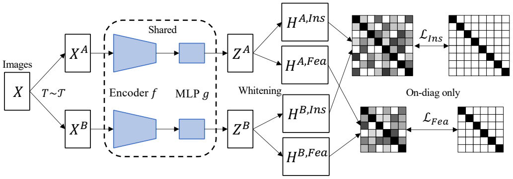

# ZeroCL: instance and feature correlation for negative-free symmetric contrastive learning (ICLR 2022)

Code of ICLR 22 paper "[ZeroCL: instance and feature correlation for negative-free symmetric contrastive learning](https://openreview.net/forum?id=RAW9tCdVxLj)"



This paper presents a negative-free contrastive learning method with symmetric architecture. Zero-CL is composed of Zero-FCL (feature dimension) and Zero-ICL (instance dimension) depending on the alignment dimension.

To pre-train the encoder on CIFAR-10 and CIFAR-100, run:
```
python main.py --epochs 1000 --dataset cifar10 (cifar100)
```
The config `--whiten` is used for comparing directly alignment (collapses) and align the feature after the whitening opration.

For ImageNet-100, train the Zero-CL in one node with several GPUs. Run: 
```
python main.py --data /imagenet100/ --epochs 400 --mode ins (fea)
```
You should implement the Dataset class by yourself.

The results are:

| Method | CIFAR-10 | CIFAR-100 | ImageNet-100 |
| :-----| ----: | :----: | :----: |
| VICReg | 90.07 (99.71) | 68.54 (90.83) | 79.22 (95.06) |
| SwAV | 89.17 (99.68) | 64.67 (88.52) | 74.28 (92.84) |
| W-MSE | 88.18 (99.61) | 61.29 (87.11) | 69.06 (91.22) |
| SimCLR | 90.74 (99.75) | 65.39 (88.58) | 77.48 (93.42) |
| Barlow Twins | 89.57 (99.73) | 69.18 (91.19) | 78.62 (94.72) |
| Zero-CL | 90.81 (99.77) | 70.33 (92.05) | 79.26 (94.98) |

For ImageNet pretraining, we implement on several nodes (distributed training). Run:
```
python main.py --data /imagenet/ --epochs 400 --mode fea
```

If you use Zero-CL as baseline, please cite our paper:
```
@inproceedings{
zhang2022zerocl,
title={Zero-{CL}: Instance and Feature decorrelation for negative-free symmetric contrastive learning},
author={Shaofeng Zhang and Feng Zhu and Junchi Yan and Rui Zhao and Xiaokang Yang},
booktitle={International Conference on Learning Representations},
year={2022},
url={https://openreview.net/forum?id=RAW9tCdVxLj}
}
```
